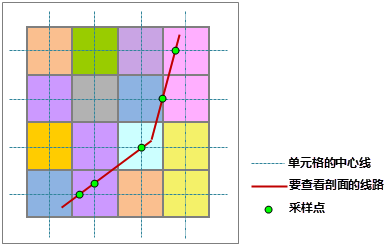
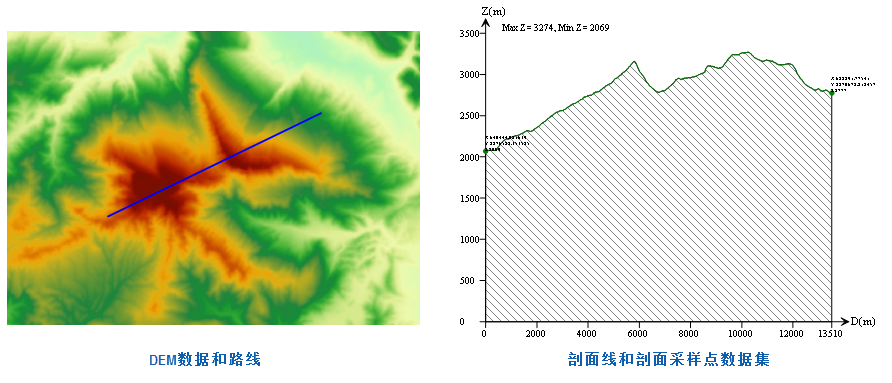
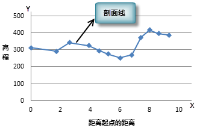

　　剖面表示表面高程沿某条线（截面）的变化。研究某个截面的地形剖面，概括研究区域的地势、地质和水文特征，包括区域内的地貌形态、轮廓形状、绝对与相对高度、地质构造、斜坡特征、地表切割强度和侵蚀因素等，非常有利于修筑道路的难度评定或对沿指定路线铺设铁路线的可行性评估，也可作为计算土方量的依据。

　　剖面分析可查看栅格表面沿指定线路的剖面，并得到剖面线和剖面采样点集合。

**采样点**

　　栅格表面是连续的，但要连续地表达出给定路线上的所有位置不太可能，因此需要沿这条线选取一些特征点，称为采样点。通过这些样点所在位置的高程和坐标信息，来展现剖面效果。如下图所示，取给定的线路与栅格像元的中心线相交的位置作为采样点。

   

**剖面线和剖面采样点坐标集合**

　　剖面线是剖面分析的结果之一，它是一条折线。线上的节点与采样点一一对应，节点的 X 值（剖面图中 D 轴）表示当前采样点到给定路线的起点（即第一个采样点）的直线距离，默认单位为米，Y 值（剖面图中的 Z 轴）为当前采样点位置的高程数值。在坐标系中，左上方标注了剖面线上所有节点高程值的最小值和最大值，同时在剖面线上标注了指定的折线上（截面）节点的 X、Y 坐标和高程值。由此可知，剖面采样点集合给出了所有采样点的位置，而剖面线用来存储这些点。结合剖面线和剖面采样点集合可以确定某位置的高程以及距离指定的线路起点的距离。

  
　　

　　下图展示了二维坐标系下的剖面线示意图，通过剖面线可以直观的了解沿给定线路上地形的高程起伏情况。

　　

### 操作说明

 1. 在工具箱的“栅格分析”-“表面分析”-“地形计算”选项中，双击“剖面分析”，即可弹出“剖面分析”对话框。
 2. 在源数据处设置要进行剖面分析的栅格数据集，并在“线数据”处选择线数据。一条线对象生成一个剖面线数据和采样点数据；如果线数据中存在多个线对象，则会生成多个剖面数据和采样点数据。
 3. 结果数据：选择生成的剖面线（CAD 数据集）要保存的数据源，以及剖面线数据的名称。 
 4. 创建剖面采样点数据集：勾选该复选框，则在生成剖面线的同时，会自动创建剖面采样点数据集；否则不会创建剖面采样点数据集。
 5. 单击“执行”按钮，即可执行剖面分析操作，执行成功后，打开结果CAD数据集，即可查看剖面线的信息。

### 相关主题

　　 [填挖方](CutFill.html)

　　 [面填挖方](CutFillRegion.html)

　　 [反算填挖方](InverseCutFill.html)

　　 [查找极值](FindExtreme.html)

　　 [DEM曲率计算](CalculateCurvature.html)

　　 [坡度分析](Slope.html)

　　 [坡向分析](Aspect.html)

　　 [正射三维影像](OrthoImage.html)

　　 [三维晕渲图](HillShade.html)
