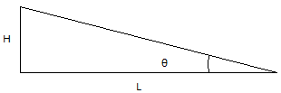
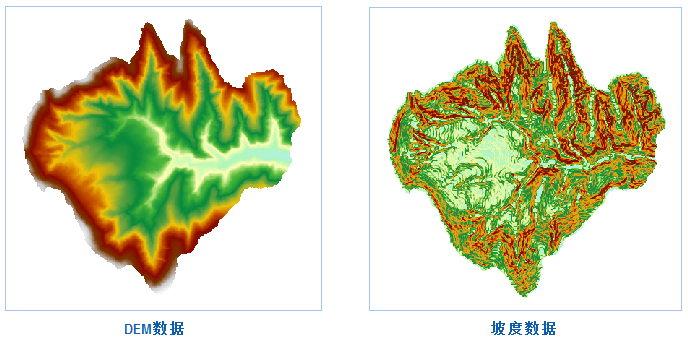

　　度和坡向是两个重要的地形特征因子，在地形表面分析中起到重要作用。其中，坡度表示地球面某一位置的高度变化率的量度。

### 分析原理

　　地表面某一点的坡度是表示地表在该点的倾斜程度的量，是既有大小又有方向的矢量。在地形分析中，坡度表示经过地表某一点的切平面和水平面所形成的夹角。根据坡度图，可以了解到区域内各位置的地形的陡峭程度。在坡度图中，每个像元都有一个坡度值，值越大表示地势越陡峭，值越小表示地势越平坦。

　　坡度可以用度数或百分数表示，其中，度数坡度是垂直增量与水平增量之比的反正切值（arctan），百分数坡度是垂直增量与水平增量之比乘以100。在 SuperMap 中，坡度计算提供了度数、弧度和百分比三种表现形式。设坡度的垂直增量为H、水平增量为L，则角度： θ = arctan(H / L)，弧度：R = θ * π / 180，百分比：P = (H / L) * 100，如下图所示：

　　

　　度数坡度的分析结果的范围是0到90°，0表示该处地表为水平面，90°表示该处地表为垂直于水平面的陡峭表面。百分数坡度的分析结果的范围是0到无穷大，当结果小于1时，表示该处坡度的高程增量小于水平增量，坡度较缓；当结果等于1时，表示该处坡度的高程增量等于水平增量，且坡度值为45°；当结果大于1时，表示该处坡度的高程增量大于水平增量，坡度变陡。

　　栅格数据集（GRID）的像元值即为中心点的值，在计算坡度和坡向时，可以通过插值得到每个点的高程值，然后计算每个点的坡度和坡向。由于计算点的坡度和坡向没有实际意义，所以该方法计算的是栅格数据集中各像元平面的坡度平均值。

### 应用场景

  - 当要在一座山上建造房子，需要找到山上比较平坦的区域；
  - 如果要在山上建滑雪场，需要选择不同的坡度分别用作初级滑道、中级滑道和高级滑道，以满足不同水平的滑雪爱好者；
  - 当参与紧急事件的救援飞机着陆时，需要找到地面相对平坦的区域；
  - 在耕地坡度等级中规定，25°为开荒限制坡度，不可在25°以上的荒地种植对于这些问题，都需要考虑地形的坡度。

### 操作说明

 1. 在工具箱的“栅格分析”-“表面分析”-“地形计算”选项中，双击“坡度分析”，即可弹出“坡度分析”对话框。
 2. 在源数据处设置要进行坡度分析的栅格数据集，通常我们会选择拥有高程值的 DEM 数据。
 3. **坡度单位类型**：选择所要使用的坡度分析单位，包括角度、弧度和百分比三种类型，用户可根据需要选择合适的类型进行坡度分析。 
 4. **高程缩放比例**：用来设置高程被拉伸的程度。数值越大表示拉伸越大，地形越夸张。当系数为1表示不拉伸。数值单位为倍，即对高程相对于原始高度拉伸的倍数。 
 
 5. 设置结果数据所要保存的数据源，及结果数据集的名称，坡度数据集是与源数据集等大且分辨率相同。
 6. 单击“执行”按钮，即可执行坡度分析操作，结果如下图所示：

　　

### 相关主题

 [融合](Datafuse.html)

