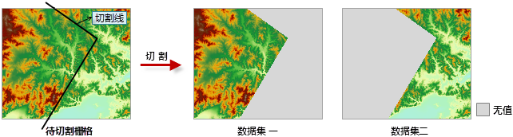

　　当需要将已有栅格数据的一部分作为研究范围，且希望保持原有栅格数据的空间范围时，可以对栅格进行切割。

　　DEM 切割功能根据给定的一条二维线（称为“切割线”）对栅格数据集进行切割，切割的结果为两个新的栅格数据集，分别为切割线左侧和右侧的部分。切割线可以是直线、折线或多边形等。左侧和右侧是指切割线的节点序列方向的左侧和右侧。切割线所经过的那些单元格是分配到左侧还是右侧，即如果单元格的中心点位于分割线的左侧（或右侧），则该单元格分配到该侧。 

　　DEM 切割与栅格地图裁剪不同，DEM 切割得到的两个结果数据集的空间范围与原栅格数据的空间范围一致，无数据的部分被赋予“无值”，而栅格地图裁剪的结果为一个数据集，并且空间范围即为裁剪出来的区域的范围，比原数据的范围要小。

### 操作说明

 1. 在工具箱的“栅格分析”-“表面分析”-“地形计算”选项中，双击“DEM切割”，即可弹出“DEM切割”对话框。
 2. 在源数据处选择要进行切割的栅格数据集，以及用以切割的线数据集。
 3. 设置结果数据所要保存的数据源，及结果数据集的名称，坡度数据集是与源数据集等大且分辨率相同。
4. 单击“执行”按钮，即可执行坡向分析操作，结果如下图所示：

　　

### 相关主题

　　 [填挖方](CutFill.html)

　　 [面填挖方](CutFillRegion.html)

　　 [反算填挖方](InverseCutFill.html)

　　 [查找极值](FindExtreme.html)

　　 [DEM曲率计算](CalculateCurvature.html)

　　 [坡度分析](Slope.html)

　　 [坡向分析](Aspect.html)

　　 [剖面分析](Profile.html)

　　 [正射三维影像](OrthoImage.html)

　　 [三维晕渲图](HillShade.html)
