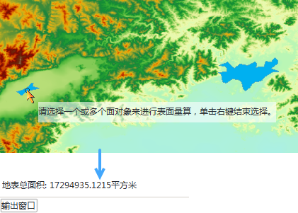

　　栅格表面面积，可计算所选多边形区域内的栅格数据集拟合的曲面的总的表面面积。

　　应用程序提供了2种计算表面面积的方式：一种是通过绘制多边形的方式，计算绘制多边形的表面面积；一种是直接选择矢量数据集中的一个或者多个面对象，计算其表面面积（之和）。

###  绘制多边形

1. 在地图窗口中打开要计算表面面积的栅格数据集。注意：当前工作空间中，如果不存在打开的栅格数据时，该功能不能使用。
2. 点击“空间分析”→“栅格分析”→“表面分析”下拉按钮，在弹出的下拉菜单中选择“表面量算”中的“地表面积”。
3. 输出窗口中提示：“请用鼠标在地图上画一个多边形，然后单击右键进行分析”，同时鼠标状态变为绘制状态。
4. 在地图上画一个多边形，单击鼠标右键，完成操作。
5. 应用程序会在地图窗口以及输出窗口显示分析的临时多边形栅格表面的面积大小。默认的面积单位为平方米。按住 Esc 键可以清除地图窗口中绘制的临时多边形。

###  选中多边形对象

1. 如果地图窗口中同时存在栅格数据和面数据，选中一个或者多个多边形对象（按住 Shift 键可以选择多个多边形对象）。 
2. 单击“空间分析”→“栅格分析”→“表面分析”下拉按钮，在弹出的下拉菜单中选择“表面量算”中的“选面面积”，对多边形对象的表面面积进行量算。 
3. 此时输出窗口会显示分析的表面面积大小。 

　　或执行以下操作：

1. 单击“空间分析”→“栅格分析”→“表面分析”下拉按钮，在弹出的下拉菜单中选择"表面量算"中的"选面面积",地图中会弹出提示"选择一个或多个面对象进行表面量算，单击右键结束选择"。 
2. 根据提示选择一个或者多个面对象（按住 Shift 键可以选择多个面对象），单击右键结束选择。 
3. 此时输出窗口会显示分析的表面面积大小。 

　　注：当选中多个面对象时，量算结果为多个面对象的表面面积之和。默认距离的单位为平方米。按住 Esc 键可以清除地图窗口中面对象的选中状态。

　　