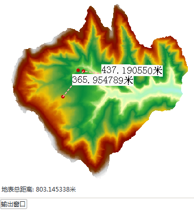
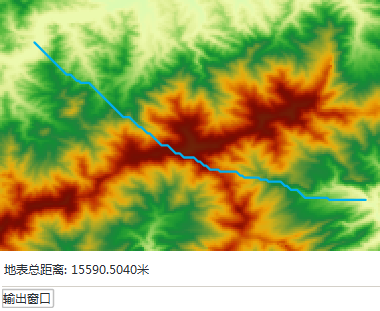

　　栅格表面距离，可计算在栅格数据集拟合的三维曲面上沿指定的线段或折线段的曲面距离。表面量算所量算的距离是曲面上的，因而要比平面上的值要大。

　　应用程序提供了2种计算表面距离的方式：一种是通过绘制对象的方式，量算绘制对象的表面距离；一种是直接选择其他数据集中的一个或者多个对象，量算其表面距离（之和）。

###  绘制线

1. 在地图窗口中打开要计算表面距离的栅格数据集。注意：当前工作空间中，如果不存在打开的栅格数据时，该功能不能使用。
2. 点击“空间分析”→“栅格分析”→“表面分析”下拉按钮，在弹出的下拉菜单中选择“表面量算”中的“地表距离”。
3. 输出窗口中提示：“请用鼠标在地图上画一条直线或折线，然后单击右键进行分析”，同时鼠标状态变为绘制状态。
4. 在地图上画一条折线或者直线，单击鼠标右键，完成操作。
5. 应用程序会在地图窗口中显示每段分析的表面距离大小，并在输出窗口中显示地表总距离，如下图所示。默认距离的单位为米。按住 Esc 键可以清除地图窗口中绘制的临时线段。

　　

###  选中线

1. 如果地图窗口中同时存在栅格数据和线数据，选中一个或者多个线对象（按住 Shift 键可以选择多个线对象）。
2. 在“空间分析”选项卡的“栅格分析”组中，单击“表面分析”下拉按钮，在弹出的下拉菜单中选择“表面量算”中的“选中线对象”子项，对线对象的表面距离进行量算。 
3. 应用程序会在地图窗口和输出窗口显示分析的表面距离大小。 

　　或执行以下操作：

1. 在"空间分析"选项卡的"栅格分析"组中，单击"表面分析"下拉按钮，在弹出的下拉菜单中选择"表面距离"中的"选中线对象"子项,地图中会弹出提示"选择一个或多个线对象进行表面量算，单击右键结束选择"。 
2. 根据提示选择一个或者多个线对象（按住 Shift 键可以选择多个线对象），单击右键结束选择。 
3. 应用程序会在地图窗口和输出窗口显示分析的表面距离大小。 

　　注：当选中多个线对象时，量算结果为多个线对象的表面距离之和。默认距离的单位为米。按住 Esc 键可以清除地图窗口中线对象的选中状态。

　　