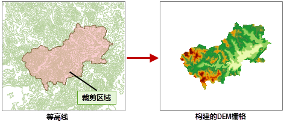
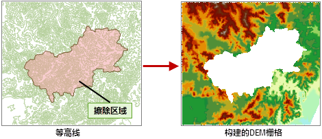
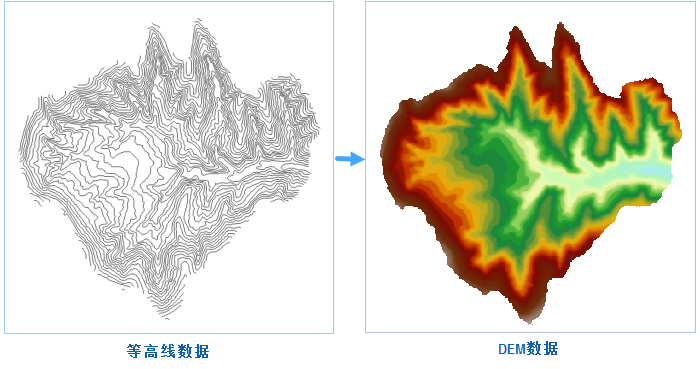

　　地形数据是进行地形分析的基础，可以利用地形数据提取坡度坡向的基础地形因子，以及进行水文分析、可视性分析等较复杂的地形分析功能。只有构建高质量的地形数据，才能保证我们后续分析结果的可靠性。因此构建地形具有十分重要的意义。

### 操作说明

1. 功能入口有以下两种方式：
  - 在“空间分析”选项卡的“栅格分析”组中，单击“DEM构建”下拉按钮，选择“DEM构建”选项。
  - 在工具箱的“栅格分析”-“DEM构建”选项中，双击“DEM构建”选项，或将该选项拖入可视化建模的画布中。
2. 源数据：选择用于构建地形的等高线数据或高程点数据，必填参数。
3. 湖数据：若构建的DEM范围内有湖数据，则可设置 DEM 挖湖的湖面数据。使用挖湖功能时，会用湖面的高程值替换 DEM 中湖面对应位置的栅格值。湖数据为选填参数。
4. 裁剪数据：设置裁剪面数据集，应用程序将对该裁剪数据区域覆盖的像元生成 DEM，区域外的部分将赋予无值。

  

5. 擦除数据：设置擦除数据集，应用程序将对擦除数据覆盖区域内的像元赋予无值，区域外的部分不做处理。**注意**：擦除数据集的设置仅在插值类型为不规则三角网(TIN)时有效。

  

6. 基本设置：
  - **高程字段**：选择用以插值的高程字段，用于提供地形特征信息，也就是高程值。
  - **湖高程字段**：设置湖数据的高程字段，通过该字段来标识湖面的高程值，该值将作为结果DEM数据在面数据相应位置的栅格值，如果没有指定高程字段，应用程序会将所有与湖岸线相交的单元格中，高程值最小的单元格的值作为DEM数据湖泊区域的值。
  - **插值类型**：设置生成 DEM时，使用的插值方法。应用程序提供了三种插值方式，不规则三角网（TIN）、距离反比权重插值法（IDW）和克吕金插值法（Kriging）。关于这三种方法的介绍，请参阅[构建 DEM 概述](AboutTerrainBuilder.html)。 
  - **重复点处理**：设置重复点处理方式。在有些情况下，用于构建 DEM  的源数据有重复点（线对象的节点）的情况出现。应用程序提供了两类处理方式，第一种是使用其中一个点的高程值，将之后出现的其他重复点去除；另外一种采用重复点的所有高程值的统计值，如平均值、最大（小）值、众数、中位数等。 
     - 平均值：取所有重复点的平均值作为该位置的高程值。
     - 中位数：取所有重复点高程值的中位数作为该位置的高程值。
     - 众数：取所有重复点高程值中出现次数最多的高程值作为该位置的高程值。
     - 最大值：取所有重复点高程值中的最大值作为该位置的高程值。
     - 最小值：去所有重复点高程值中的最小值作为该位置的高程值。
  - **重采样距离**：设置重采样容限大小。重采样距离是指线上相邻两个节点之间，其中一个点到两点之间连线的垂距。距离越大，采样结果数据越简化。采样距离用于对线数据集进行重采样，来过滤掉一些比较密集的节点，然后再生成TIN模型，可以提高生成速度。采样距离仅在源数据包含线数据集且插值方法为TIN时有效，
  - **高程缩放系数**：用来设置高程被拉伸的程度。数值越大表示拉伸越大，地形越夸张。当系数为1表示不拉伸。数值单位为倍，即对高程相对于原始高度拉伸的倍数。 
  - **处理平坦区域**：设置在构建DEM时是否对平坦区域进行处理

7. 结果设置
  - **编码类型**：设置生成的地形数据的编码方式。应用程序提供了三种编码方式，未编码、SGL 和 DCT。
  - **像素格式**：设置生成的地形数据的像素格式。应用程序提供了多种常用的像素格式，包括1位、4位、单字节、双字节、三字节、整型、长整型、单精度浮点型、双精度浮点型9种。
  - **分辨率**：设置生成的 DEM 数据的分辨率。默认分辨率的计算公式是 L/500，其中，L 表示边界长度，取结果数据集的区域范围内宽（Width）和高（Height）之间最大的边的值，500表示边界 L 所容纳单元格的默认数量，计算结果为每个像元的大小。分辨率的单位与参与生成 DEM 的矢量数据的坐标系统单位保持一致。 
  - **行列数**：根据设置的分辨率大小，会自动估算生成的 DEM 的行数和列数 。
  - **估计大小**：根据设置的分辨率大小，会自动估算生成的 DEM大小，单位为：MB。
8. 结果数据：设置结果数据集所保存的数据源，及名称。
9. 单击“确定”或者“执行”按钮，即可开始构建DEM，结果如下图所示：

　　

### 相关主题

　　 [DEM构建概述](AboutTerrainBuilder.html)

　　 [DEM挖湖](Datafuse.html)

