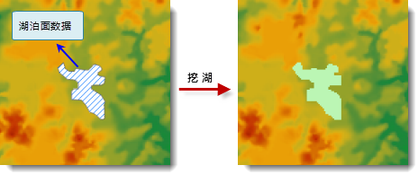

　　DEM 挖湖具有十分重要的应用意义。传统构建 DEM 的方法通过点数据或者线数据，只能构建出区域内的大地形，对于局部地区的微地形，如湖泊、洼地、冰川等无法展现。DEM 挖湖功能可以帮助用户在构建的 DEM 中很好的体现这些地形特征。在 DEM 挖湖过程中，获取类似于湖泊、洼地等面数据的高程信息，将面数据的高程值赋给 DEM 数据中相应位置的像元，重新得到一个 DEM 数据。

　　应用程序中有2个地方可以实现 DEM 挖湖，一种是在构建 DEM 的过程中，一并实现 DEM 挖湖功能，最终构建的 DEM 数据是带有湖泊的 DEM；另外一种是先完成 DEM 的构建，然后再进行挖湖操作。第一种 DEM 挖湖的方式，请参阅[DEM 构建](TerrqinBuilder.html)页面的说明，第二种方式本页面将进行介绍。

### 操作说明

1. 功能入口有以下两种方式：
  - 在“空间分析”选项卡的“栅格分析”组中，单击“DEM构建”下拉按钮，选择“DEM挖湖”选项。
  - 在工具箱的“栅格分析”-“DEM构建”选项中，双击“DEM挖湖”选项，或将该选项拖入可视化建模的画布中。
2. 源数据：选择要进行挖湖操作的DEM数据。
3. 湖数据：选择湖面数据所在的数据源以及湖面数据集。
4. 设置高程信息。提供了两种设置高程信息的方式。 
  - 高程字段：单击“高程字段”单选按钮，选择面数据集中的某个字段，作为高程字段，获取湖面数据的高程信息。
  - 高程值：单击“高程”单选按钮，在文本框中手动输入数值，作为湖面数据的高程信息。 
5. 以上参数设置完成后，单击“确定”按钮，执行 DEM 挖湖操作，结果如下图所示：

  

### 相关主题

　　 [DEM构建概述](AboutTerrainBuilder.html)

　　 [DEM构建](TerrainBuilder.html)

