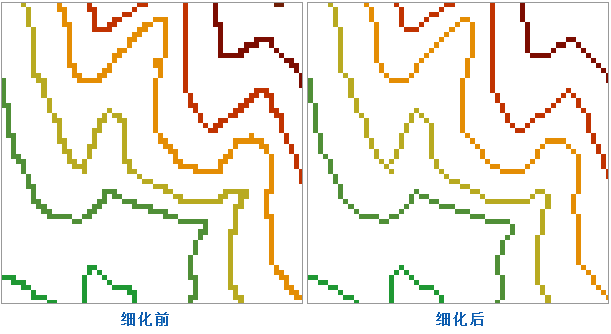

　　栅格细化是指在矢量化前先对栅格数据进行预处理以提高矢量化的速度和精度，只适用于栅格数据转矢量线数据的过程。栅格细化功能同时支持栅格数据和影像数据。栅格矢量化操作，也提供了栅格细化功能，即对栅格/影像数据进行线矢量化时，可以实现细化处理功能。关于栅格矢量化的功能，请参阅栅格矢量化。

　　栅格数据细化处理可以减少栅格数据中用于标识线状地物的像元的数量，从而提高矢量化的速度和精度。一般作为栅格转线矢量数据之前的预处理操作，可以使转换效果更好。例如一幅扫描的等高线图上（影像数据）可能使用5、6个像元来显示一条等高线的宽度，细化以后，等高线的宽度可能只用一个像元来显示了。

### 操作说明

1. 功能入口有以下两种方式：
  - 在“空间分析”选项卡的“栅格分析”组中，单击“矢栅转换”下拉按钮，选择“栅格细化”选项。
  - 在工具箱的“栅格分析”-“矢栅转换”选项中，双击“栅格细化”选项，或将该选项拖入可视化建模的画布中。
2. 源数据：选择需要细化的栅格或者影像数据集。
3. 设置栅格细化的参数。由于选择栅格数据类型的不同，需要设置的参数也不相同。 
 - **栅格数据**
     - **无值**：得到的结果数据集中值为空值的数值，即栅格细化后像元值若为无值，则赋为-9999。 设为无值的像元，在进行栅格细化时，不参与计算；当用多个像元来表示的一条线时，细化后只用一个像元来显示，那么其他的像元值就用这个无值来进行填充。用户可点击按钮，拾取已打开的栅格数据集的值，将其设为“无值”，用户也可直接输入已打开的栅格数据集的一个栅格值。
     - **容限**：设置无值数据的容限，假设无值数据设为 r、容限值设为 a 时，无值数据的范围是 [r-a, r+a]。

 - **影像数据**
     - **无值**：指定的影像数据像元值被视为无值，设为无值的像元，在进行栅格细化时，不参与计算，不会被转换。“无值”默认值与影像数据集的像素格式有关：无值的默认值为像素格式对应数据值范围的最大值。如影像数据的像素格式为24位真彩色，数据集可表示0-16777215共16777216个整数值，则默认的无值为16777215。用户可点击按钮，拾取已打开的栅格数据集的值，将其设为“无值”，用户也可直接输入已打开的栅格数据集的一个栅格值
     - **容限**：设置无值数据的容限，假设无值数据设为 r、容限值设为 a 时，无值数据的范围是 [r-a, r+a]。

4. 设置结果数据参数，选择处理后结果要保存的数据源，以及结果数据集名称。 
5. 完成栅格细化相关参数的设置后，单击“确定”按钮，执行操作；单击“取消”按钮，放弃操作。 

  

### 相关主题

　　 [栅格矢量化](RasterToVector.html)

　　 [矢量栅格化](VectortoRaster.html)

