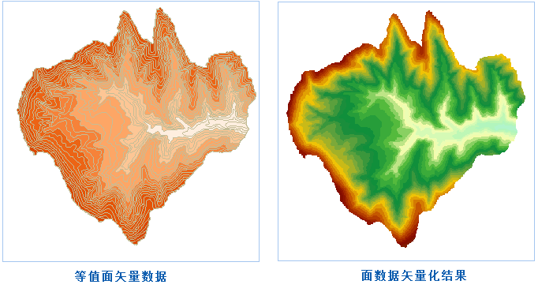

　　矢量栅格化可以简单的理解为将矢量数据集转换为栅格数据集，支持二维的点数据集、线数据集、面数据集转换为栅格数据集。

### 操作说明

1. 功能入口有以下两种方式：
  - 在“空间分析”选项卡的“栅格分析”组中，单击“矢栅转换”下拉按钮，选择“矢量栅格化”选项。
  - 在工具箱的“栅格分析”-“矢栅转换”选项中，双击“矢量栅格化”选项，或将该选项拖入可视化建模的画布中。
2. 源数据：选择需要栅格化的矢量数据集，支持点、线、面数据集。
3. 边界数据：选择面数据集为边界数据，仅对源数据集与边界数据集相交的部分进行栅格化操作。 
4. **栅格值字段**：选择源数据集中一个字段值作为结果数据集的像元值。注意：栅格值字段中的数值范围需要与像素格式相匹配，即栅格字段值的取值范围需要位于结果数据集的像素格式的存储范围内，一旦栅格字段值超出结果数据集“像素格式”的存储范围时，对应像元的栅格值将被处理成0。例如，“像素格式”设置为“4位”时，其存储范围为[0,15]，共16个整数。若某个字段值为20（超出“4位”像素格式的存储范围），则该字段值对应的像元栅格值将被处理成0。
5. **像素格式**：设置结果数据集的像素格式。包括：1位、4位、单字节、双字节、整型、长整型、单精度浮点型和双精度浮点型等8种。用户可根据实际需求选择合适的像素格式，像素格式的说明如下表：  
  
像素格式|描述  
-|-  
单精度浮点型|每个像元用4个字节来表示，栅格像元值范围为1.5E-45到3.4E+38范围内的单精度浮点数。  
双精度浮点型|每个像元用8个字节来表示，栅格像元值范围为5.0E-324到1.7E+308范围内的双精度浮点数。  
8位|每个像元用 8 个比特，即 1 个字节来表示。栅格像元值范围为 -128 到 127，共 256 个整数值。  
16位|每个像元用 16 个比特，即 2 个字节表示。栅格像元值范围为 -32768 到 32767 共 65536 个整数值。  
32位|每个像元用32个比特，即4个字节来表示，栅格像元值范围为2E-32到2E+32-1之间的整数值。  
64位|每个像元用64个比特，即8个字节来表示，可表示的像元值范围为2E-64到2E+64-1。  
1位无符号|每个像元用1个比特表示，栅格像元值为0和1。  
4位无符号|每个像元用 4 个比特表示。对栅格数据集来说，可表示 0 到 15 共 16 个整数值。  
8位无符号|每个像元用 8 个比特，即 1 个字节表示。对栅格数据集来说，可表示 0 到 255 共 256 个整数值。  
16位无符号|每个像元用 16 个比特，即 2 个字节来表示。对栅格数据集来说，可表示 0 到 65535 共 65536 个整数值。  
64位无符号|每个像元用64个比特，即8个字节来表示，可表示的像元值范围为0到2E+64-1。

6.**分辨率**：设置栅格数据集的分辨率。默认分辨率的计算公式是 L/500，其中，L 表示边界长度，取结果数据集的区域范围内宽（Width）和高（Height）之间最大的边的值，500表示边界 L 所容纳单元格的默认数量，计算结果为每个像元的大小。此外，用户也可以自行调整结果数据集分辨率的大小。分辨率的单位与源数据集的地理单位相同。
  
7.结果数据：设置结果数据的名称及所保存在的数据源。
  
8.将界面参数切换至“**环境**”面板，设置分析环境，具体操作请参见[分析环境设置](AnalystEnvironment.html)页面。
  
9.以上参数设置完成后，单击“执行”按钮，执行矢量栅格化操作，结果如下图所示：

  

### 相关主题

　　 [栅格矢量化](RasterToVector.html)

　　 [栅格细化](ThinRaster.html)

