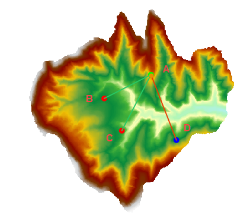

　　多点可视性分析是对多个观察点和被观察点，在输入的栅格数据表面上的通视性进行分析，即能否两两相互通视。

- 当前地图窗口中必须存在 Grid/DEM 数据集时，才可以使用通视分析功能。
- 附加高程值作为观察点的总高程组成部分之一，对通视分析的结果有重要影响，因此需要了解观察点的表面高程值以及附加高程值，以保证分析结果更符合实际情况。
- 当有多个观察点时，会对所有观测点的两两之间的可视性进行分析。 
 

###  操作步骤

　　用以下数据为示例进行分析：SampleData/ExerciseData/RasterAnalysis/Terrai.udb，其中有分辨率为5米的 DEM 数据。 

1. 单击“空间分析”→“栅格分析”→“表面分析”→“可视域”→“多点可视性”，即可弹出“多点可视性分析”对话框。 
2. 指定当前分析图层。若当前地图窗口中有多个栅格图层，需要在此处选择想要对哪个图层进行可视性分析。 
3. 指定观察点：通过鼠标单击的方式添加，打开对话框后将鼠标移至地图中，即可在栅格表面单击鼠标选取观察点。选定的观察点会在地图上用蓝色高亮标识。
4. 附加高程值：可以修改某一观测点的附加高程值，也可以全部选中统一修改所有观测点的附加高程值。
5. 观测点的角色：至少保证有一个点为观察点，另外一个点为被观察点。
6. 保存阻视点：将阻视点保存为数据集，需要选择要保存的数据源以及输入数据集名称。
7. 结果设置：设置是否在地图窗口中显示所有通视的观测点以及所有不通视的观测点。如想获取详细分析结果，可以勾选“保存详细结果”，将分析结果输出为一个文本文件。 
8. 单击“分析”按钮，即可进行多点可视性分析，结果图示如下，显示了观察点与被观察点直接两两的可视性，红色的线表示不通视，绿色的线表示通视。下图结果表示：A与B、C通视，A与D不通视，不通视路径的阻视点被存储在了数据源下面的BarrierPoint数据集中。

　　

