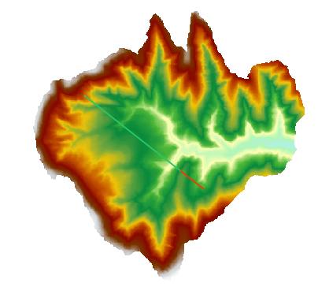

　　根据给定的观察点和被观察点，在输入的栅格表面上对这两个点之间能否相互通视进行分析。

 - 当前地图窗口中必须存在 Grid/DEM 数据集时，才可以使用通视分析功能。 
 - 附加高程值作为观测点的总高程组成部分之一，对通视分析结果有重要影响，因此需要了解观察点的表面高程值以及附加高程值，以保证分析结果更符合实际情况。 

###  操作步骤

　　用以下数据为示例进行分析：SampleData/ExerciseData/RasterAnalysis/Terrai.udb，其中有分辨率为5米的 DEM 数据。 

1. 单击“空间分析”→“栅格分析”→“表面分析”→“可视域”→“两点可视性”。 
2. 指定观察点：此时将鼠标移至地图窗口中，在地图窗口中绘制一条线段，线段端点分别为可视性分析的两点。绘制的线段在地图窗口中高亮显示。
3. 绘制结束后弹出“两点可视性分析”对话框，对话框中显示了观察点与被观察点的坐标信息、高程值，如需设置观测点的附加高程值，在对话框中输入即可。
   - **附加高程**：观察点高出栅格表面的相对高度。比如在地图上选择的点的高程为430米，附加高程值为100米，则分析点的高程为530米。默认值为0。

4. 单击“确定”按钮，即可进行两点可视性分析，结果图示如下，红色的线表示不通视，绿色的线表示通视。在输出窗口中会显示可视性分析结果，通视或者不通视；若不通视会则提示第一个阻视点的坐标以及高程值。

　　

