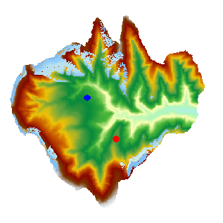

　　可视域分析是在栅格数据的表面，对于一个或者多个观察点，基于一定的相对高度，提取给定长度范围和方向范围内所能看到的区域，并将分析结果输出为一个栅格数据集。

- 附加高程值作为观察点的总高程组成部分之一，对可视域的分析结果有重要影响，因此需要了解观察点的表面高程值以及附加高程值，以保证分析结果更符合实际情况。 
- 观测半径默认值为0，表示在整个分析区域内进行查找，观测半径的单位与参与分析的栅格数据集保持一致。 
- 当有多个观察点时，可视域的分析结果可以是所有观察点的可视区域的并集或者交集。当使用“共同可视域”参数时，表示取所有观察点的可视区域的交集，否则取所有观察点的可视区域的并集。 

###  操作步骤

　　用以下数据为示例进行分析：SampleData/ExerciseData/RasterAnalysis/Terrai.udb，其中有分辨率为5米的 DEM 数据。 

1. 单击“空间分析”→“栅格分析”→“表面分析”→“可视域”项，弹出“可视域分析”对话框。 
2. 指定观察点：通过鼠标单击的方式添加，打开对话框后将鼠标移至地图中，即可在栅格表面单击鼠标选取观察点。选定的观察点会在地图上用蓝色高亮标识。
3. 可视域分析参数设置，包括附加高程、观测半径、起始角度和观察角度。 
   - **附加高程**：观察点高出栅格表面的相对高度。比如在地图上选择的点的高程为430米，附加高程值为100米，则分析点的高程为530米。默认值为0。
   - **观测半径**：用来设置可视域分析时的长度范围。可视域为以观察点为圆心，此数值为半径的圆形区域。系统默认0，表示使用栅格表面数据集的最大范围。
   - **起始角度和观察角度**：用来设置可视域分析的方向范围。起始角度为0度，表示从正北方向开始，按照顺时针方向搜索，达到最大观察角度时停止。默认最大观察角度为360度。

4. 若添加了多个观察点，可单击工具栏中的“批量设置”按钮，在弹出的对话框中批量设置上述参数。
5. 在“分析结果”区域设置以下参数：
   - **数据源**：选择分析结果要保存到的数据源。
   - **数据集**：设置结果栅格数据集的名称。
   - **共同可视域**：当有多个观察点时，需要设置可视域的为各个观察点的并集还是交集。勾选“共同可视域”表示分析结果取所有观察点的交集，否则取并集。
   - **将结果数据集添加到当前地图窗口中**：选中此项，表示分析完成后，结果数据集会自动添加到当前地图窗口，否则不会自动添加。

6. 单击“分析”按钮，完成可视域分析操作，结果图示如下，蓝色区域为可视域：

　　

